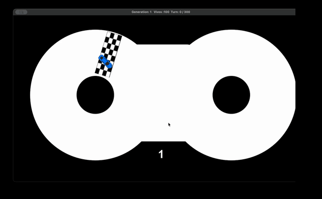

# Race Simulation
This project uses a genetic algorithm to train cars that try to complete a circut to win a race

## Objective
Train agents to learn how to run in any given map

## Rules of this project 
1. The cars have to use neuroevolution to learn
1. Only the pygame library is allowed to be used 
1. All the enviroment and agent features have to be created without using any external library
1. The training of the agents can't depend on the visulization of the project (the agents can train without rendering the map)
 
 